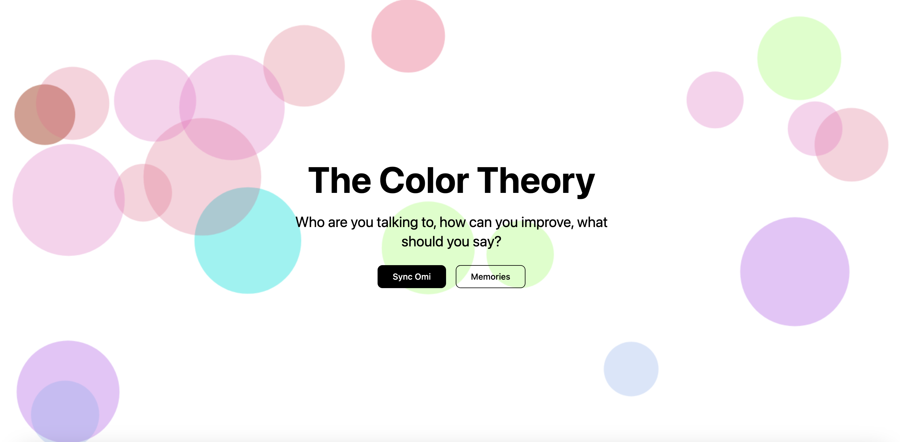

Color is all about perception– it reflects the way our eyes pick up on a substance our brains subsequently translate those wavelengths into emotions. Just like colors influence how we feel, our interactions with people influence us in distinct, emotional ways.

So what if we could map people to colors?

We built a system that takes in audio transcripts from Omi and inputs it into a general-purpose LLM that's integrated with an MCP server via the Hume API. It translates them into color personality profiles based on emotional tone, sentiment, and behavioral traits. Someone who’s cheerful and expressive might be yellow dominant. For other complex colors– we have a polar diagram reflecting the composition of a person’s color traits– because humans are too multifaceted to be attributed to one single color. On the homescreen, the bubbles are a reflection of each person, and their color changes with the mouse interactions, which is representative of how an individuals color composition may fluctuate over time as you interact more with them.

Think of a color wheel– certain colors harmonize and complement each other, while others create contrast and dimension. By mapping each person to a color trait, it becomes much easier to not only stay in touch with contacts and relationships we want to maintain, but follow up and develop meaningful relationships based on this data.

Color theory is the study of how colors work together and how they affect our emotions and perceptions. Similarly, we can study how humans behave and interact by representing them as a certain color, or combination of colors. Networking will no longer feel like exchanging telegrams or Linkedins over mundane drinks— it will start to feel like building a color palette of relationships.
